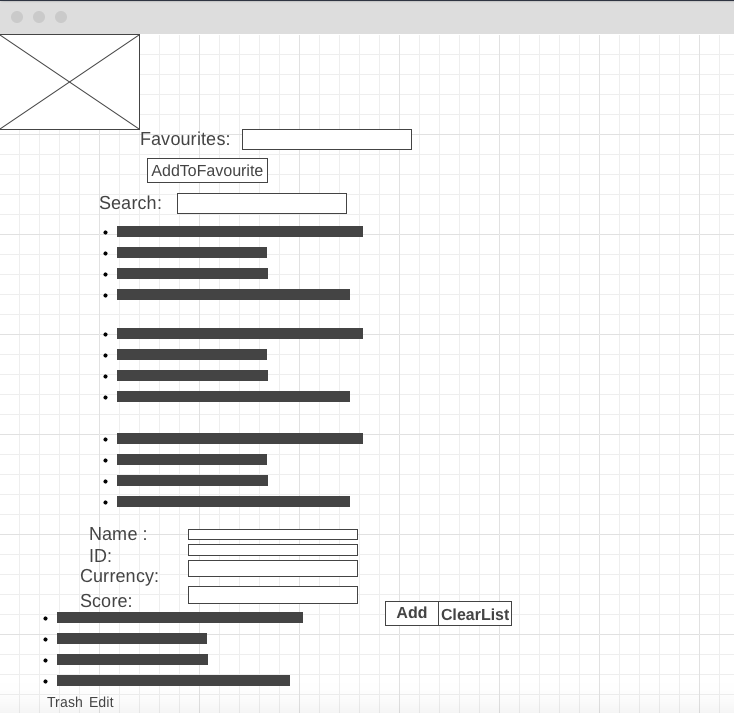

### Descriprtion :

 
Building React Project From step one by selecting API and Start WireFrame then cooding .

### User Stories :

- The User can see the list of Country and the trip information Item .
- The User can add to the list of Country Item .
- The User can delete to the list of Country Item .
- The User can delete one item from list of Country Item
- The User can Add to the Favourite .
- the User can Search on specific Country .

#### wireframe of the main page:

### Tools :

1-javascripts .
2-React.
3-CSS .
4-bootsrap .

### UnderProccess Function :

- Delete Selected item
- Favourite Function

### Issues :

The main requirement is not completed I stuck on chossing the subject then the API ,Also the distripution of the page was one of the big complex to me .
